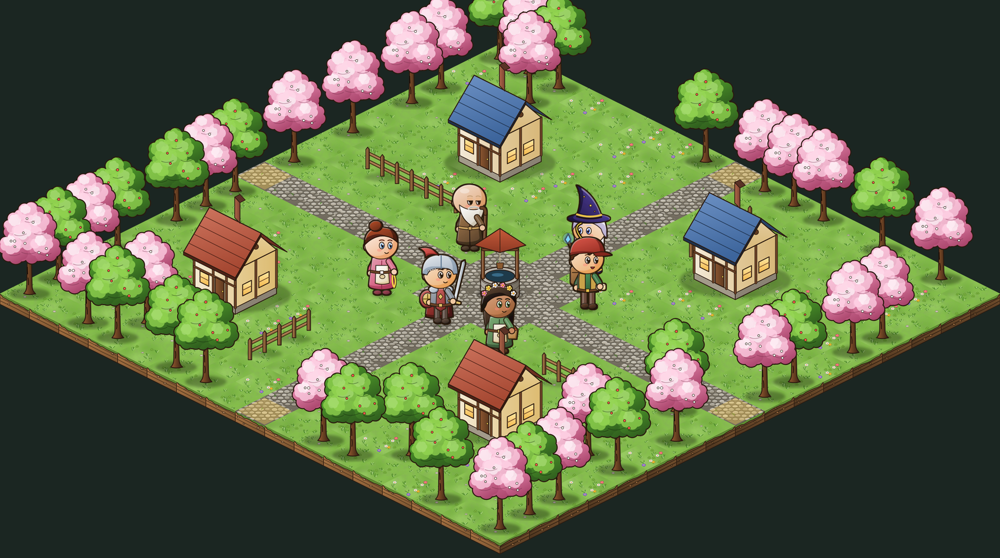
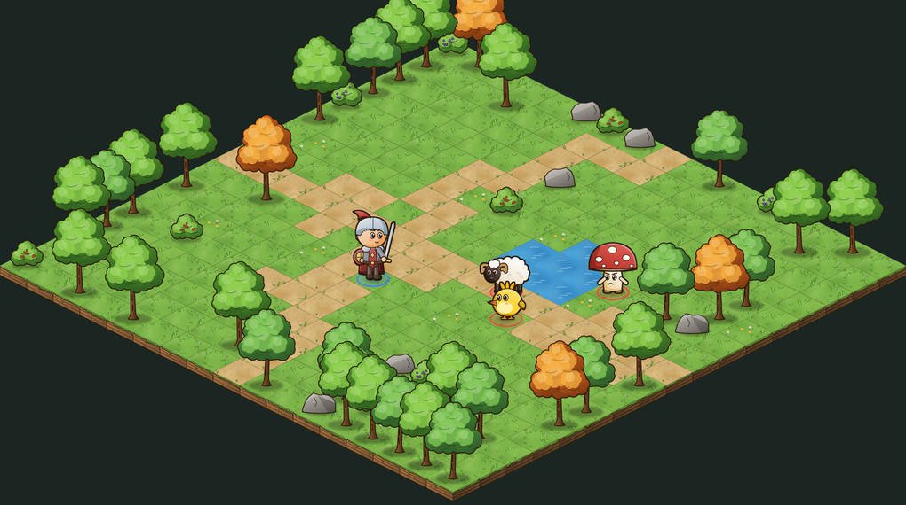
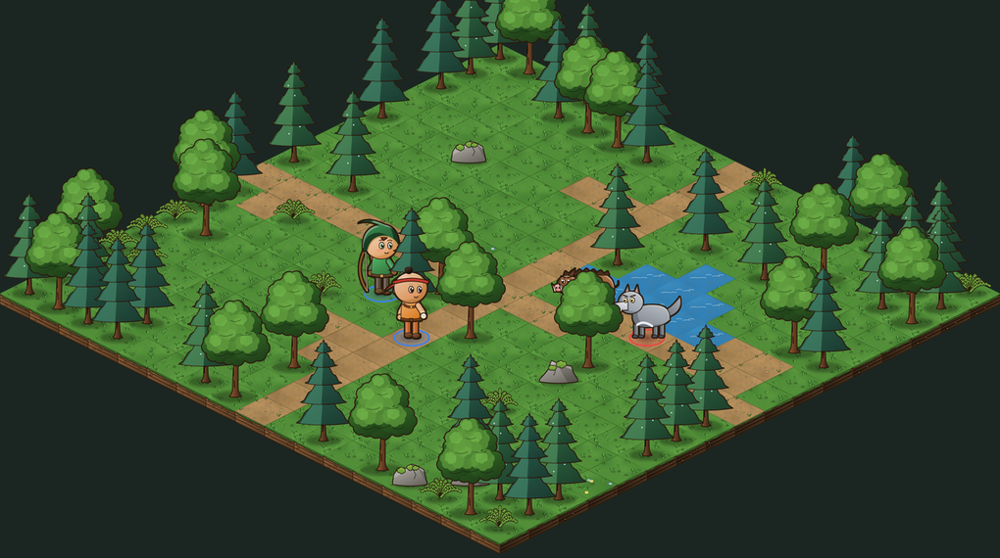
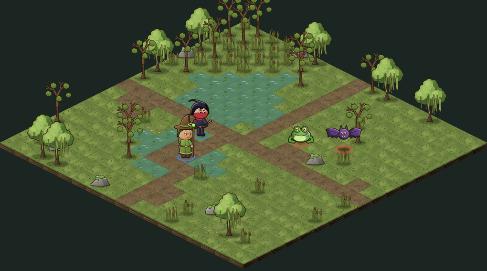
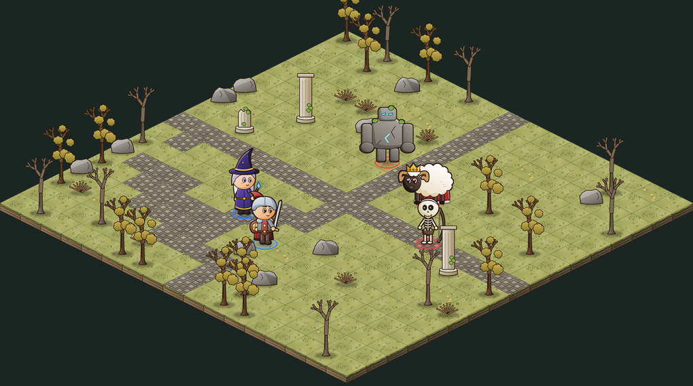
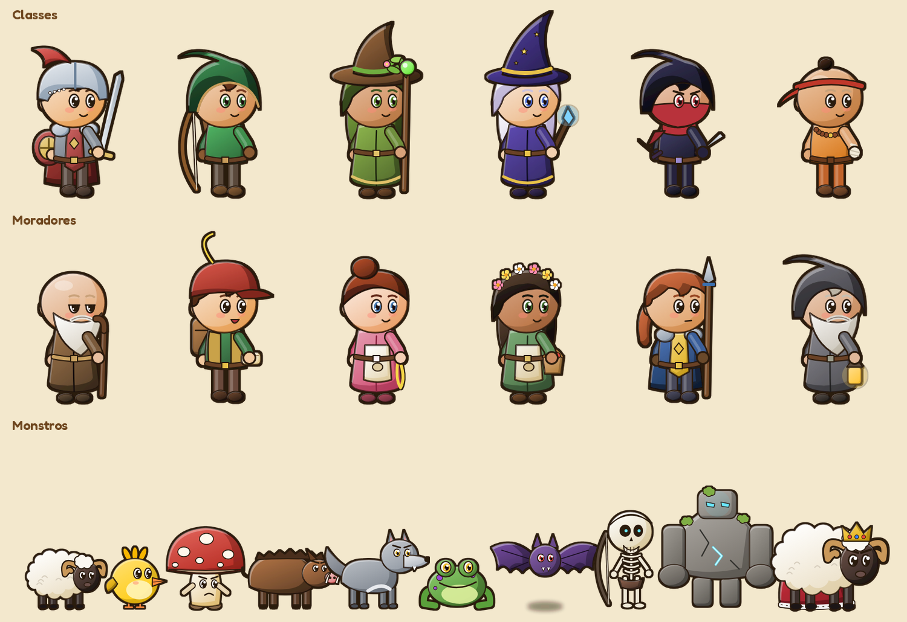
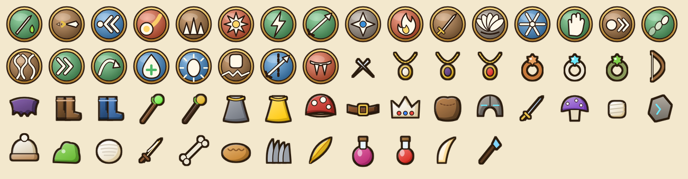

# Aldaria

**RPG tático por turnos no estilo Dofus**, feito em **Unity 6**: mundo isométrico dividido em
mapas com coordenadas `[x,y]`, vila com moradores e missões, grupos de monstros passeando e
combate por turnos com **PA** (pontos de ação), **PM** (pontos de movimento), feitiços com
alcance, linha de visão, área, empurrão, veneno e roubo de vida.



| | |
|---|---|
|  |  |
|  |  |




> As imagens acima foram montadas com a arte do jogo pelas ferramentas de prévia (sem a interface).

## Como abrir

1. Instale o **Unity Hub** e o **Unity 6 (6000.0 LTS)**. Outras versões 6000.x devem funcionar.
2. No Unity Hub: **Add → Add project from disk** e escolha esta pasta.
3. Aperte **Play**. Não precisa montar cena nem arrastar nada: o jogo se monta sozinho por código
   (`GameController` usa `RuntimeInitializeOnLoadMethod`).
4. Para gerar executável: menu **Aldaria → Build → WebGL / Windows / Linux**
   (ele cria a cena `Assets/Scenes/Aldaria.unity` sozinho se ainda não existir).

## Controles

| Ação | Como |
|---|---|
| Andar | Clique numa célula |
| Conversar | Clique num morador (**!** = missão nova, **?** = missão para entregar) |
| Lutar | Clique num grupo de monstros |
| Trocar de mapa | Ande até uma célula com brilho dourado na borda |
| Inventário / Missões | **I** / **J** (ou os botões no canto) |
| Posicionar no início da luta | Clique numa célula azul e depois em **Pronto!** |
| Mover na luta | Clique numa célula verde (gasta PM) |
| Feitiço | Teclas **1-4** ou clique no ícone, depois clique no alvo |
| Cancelar feitiço / fechar painel | Botão direito ou **Esc** |
| Passar o turno | **Espaço** ou *Passar turno* (30 s por turno) |
| Zoom | Rolagem do mouse |

## O que tem no jogo

- **4 classes**, cada uma com 4 feitiços: **Guerreiro** (corpo a corpo, salto e escudo),
  **Arqueiro** (distância, área e tiro que atravessa obstáculos), **Mago** (magia sombria,
  explosão ao redor de si e PA extra) e **Assassino** (veneno, roubo de vida e teletransporte).
- **Mapas grandes** que ocupam a tela inteira (543 células cada, no formato retangular do Dofus).
- **10 monstros** em 4 regiões: Pradaria (Lanudo, Pipio, Cogumelo Bravo), Floresta (Javali,
  Lobo Cinzento), Pântano (Sapo Venenoso, Morcego), Ruínas (Esqueleto Arqueiro, Golem de Pedra)
  e o chefe **Rei Lanudo** no mapa `[-3,0]`.
- **Vila de Aldaria** em `[0,0]` com 4 moradores, mais a Capitã Ferra na floresta e o eremita nas ruínas.
- **8 missões** encadeadas (derrotar monstros, coletar itens, falar com alguém, chegar a um lugar).
- **Inventário e equipamentos** em 7 espaços (arma, chapéu, capa, amuleto, anel, cinto, botas),
  38 itens com raridade, **loja** para comprar e vender, **poções** e drops de monstros.
- Mundo com biomas diferentes; quanto mais longe da vila, mais fortes os monstros.
- XP, níveis, ouro e salvamento automático.

## Por que é leve

Toda a arte é **vetorial (SVG)** e vira PNG pequeno: são 160 desenhos que somam cerca de 3 MB.
Não há modelos 3D, e a interface é desenhada por código (IMGUI), sem prefabs.

## A arte (e como criar a sua)

```
art/src/            ← os desenhos-fonte em SVG (edite no Inkscape, Illustrator ou Figma)
tools/art/          ← gerador e conversor
Assets/Resources/Art/ ← os PNGs que a Unity usa (gerados, não edite à mão)
```

- **Editar um desenho:** abra o `.svg` em `art/src/`, altere, salve e rode
  `cd tools/art && npm install && node render.mjs`. Só isso: o jogo passa a usar o desenho novo.
- **Trocar por arte feita à mão:** substitua o SVG por outro do mesmo nome e tamanho (ou ajuste
  largura, altura e pivô em `art/src/manifest.json`).
- **Gerar tudo de novo pelo código:** `python3 generate.py` (atenção: sobrescreve os SVGs; dá
  para gerar só um grupo, por exemplo `python3 generate.py monsters`).
- Se algum desenho faltar, o jogo usa uma versão simples desenhada por código, então nunca quebra.

### Pixel art com tamanho de pixel fixo (Aseprite)

O jogo usa **64 pixels por célula** em tudo: chão, cenário, monstros, NPCs e heróis.
Depois de gerar/editar os SVGs, rode:

```
cd tools/art
node render.mjs                          # SVG → PNG em alta
node pixelize.mjs --aseprite <aseprite>  # reduz para 64 px/célula + paleta fixa (art/palette.gpl)
```

O `pixelize.mjs` usa o **Aseprite pela linha de comando** (`pixelize.lua`): tira a transparência
parcial e aplica a paleta única de 64 cores, então tudo combina. Os heróis do PixelLab
(`art/pixellab`) só são ajustados para a mesma escala, mantendo as cores originais.
`--palette` recria a paleta a partir da arte atual.

Para compilar o Aseprite (versão só de linha de comando, sem interface):
`git clone --recursive https://github.com/aseprite/aseprite` e
`cmake -G Ninja -DLAF_BACKEND=none -DENABLE_UI=OFF .. && ninja aseprite`.
Você também pode abrir e editar qualquer PNG de `Assets/Resources/Art` (renomeando de `.bytes`) no Aseprite normal.

A fonte da interface é a **Fredoka** (licença OFL, em `Assets/Resources/Fonts`).

## Unity pela linha de comando

```
tools/unity/instalar-unity.sh      # baixa a Unity 6 LTS + WebGL para Linux (sem o Hub)
tools/unity/ativar-licenca.sh      # ativa a licença a partir da variável UNITY_LICENSE
tools/unity/build.sh WebGL         # gera Build/WebGL (também: Windows, Linux, CheckCompile)
```

A Unity exige uma licença, mesmo a gratuita (Personal). Para ativar numa máquina sem tela:
entre no Unity Hub no seu computador (isso cria o arquivo `Unity_lic.ulf`) e coloque o **conteúdo**
desse arquivo na variável de ambiente `UNITY_LICENSE`.

O mesmo vale para o GitHub: o workflow em `.github/workflows/build.yml` roda os testes das regras
sempre, e gera o **build WebGL** (jogável no navegador) quando os secrets `UNITY_LICENSE`,
`UNITY_EMAIL` e `UNITY_PASSWORD` estão cadastrados no repositório.

## Organização do código

```
Assets/Scripts/
  Rules/   regras em C# puro, SEM Unity (dá para rodar num servidor)
    Cell, GridMap, MapGenerator, Visuals   grid, biomas, geração dos mapas e escolha dos desenhos
    Pathfinder, LineOfSight                A*, alcance de movimento, linha de visão
    Spells, Fighter, Fight, MonsterAI      a luta por turnos e a IA
    Items, Quests, Progression             itens, inventário, missões, XP e o perfil salvo
    Catalog*.cs                            classes, monstros, itens, NPCs e missões ← conteúdo e balanceamento
  Game/    tudo que é Unity (tela, input, animação)
    GameController                         exploração, NPCs, troca de mapa, câmera
    FightDirector                          liga a luta às animações e ao input
    Hud, HudPanels                         interface: telas, inventário, missões, conversa, loja
    WorldView, Actor, Iso                  mapa e personagens em isométrico
    ArtLibrary, Art, Painter               carrega a arte (e o plano B desenhado por código)
  Editor/  Builder: builds pelo menu ou pela linha de comando
tests/Regras/   testes das regras: dotnet run -c Release
```

A luta gera uma fila de `FightEvent` (moveu, lançou feitiço, levou dano...). Hoje essa fila é
animada localmente; no modo online, o **servidor** roda o mesmo código de `Rules` e envia esses
eventos para os jogadores.

## Próximos passos

1. **Modo online**: servidor .NET reaproveitando `Rules`, contas e banco de dados.
2. Animações por quadros para os personagens (andar, atacar), sons e música.
3. Mais regiões, masmorras, profissões e criação de itens.
