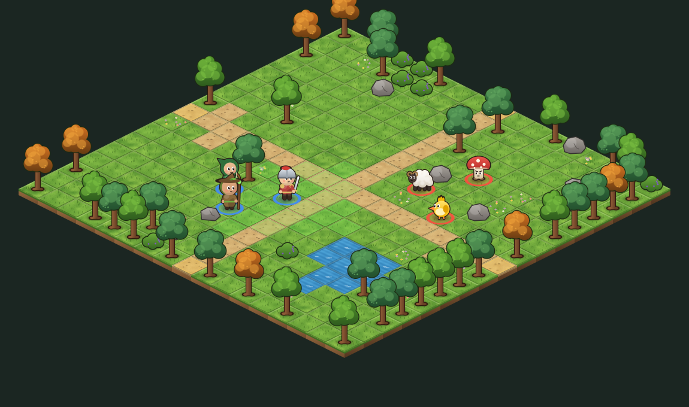
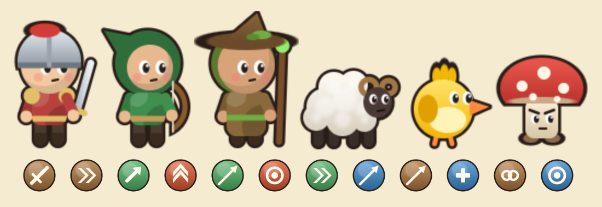

# Aldaria

Protótipo de um **MMORPG tático por turnos** no estilo Dofus, feito em **Unity**:
mapa isométrico em "ilhas" de grama, exploração clicando nas células, grupos de monstros
passeando pelo mapa e combate por turnos com **PA** (pontos de ação), **PM** (pontos de
movimento), feitiços com alcance, linha de visão, empurrão e área de efeito.




> As imagens acima foram geradas pelo próprio código de desenho do jogo (sem a interface).

## Como abrir

1. Instale o **Unity Hub** e o **Unity 6 (6000.0 LTS)**. Outras versões recentes (2022.3+) também devem funcionar.
2. No Unity Hub: **Add → Add project from disk** e escolha a pasta `aldaria/`.
3. Com o projeto aberto, aperte **Play**. Não precisa montar cena nem arrastar nada:
   o jogo se monta sozinho (`GameController` usa `RuntimeInitializeOnLoadMethod`).

Para gerar um executável: salve a cena aberta (Ctrl+S), adicione-a em
**File → Build Profiles** e faça o build para Windows, Mac, Linux, Android ou WebGL.

## Controles

| Ação | Como |
|---|---|
| Andar | Clique numa célula |
| Lutar | Clique num grupo de monstros |
| Trocar de mapa | Ande até uma célula com brilho dourado na borda |
| Posicionar no início da luta | Clique numa célula azul e depois em **Pronto!** |
| Mover na luta | Clique numa célula verde (gasta PM) |
| Feitiço | Teclas **1-4** ou clique no ícone, depois clique no alvo |
| Cancelar feitiço | Botão direito ou **Esc** |
| Passar o turno | **Espaço** ou botão *Passar turno* (cada turno tem 30 s) |
| Zoom | Rolagem do mouse |

## O que já tem

- **3 classes**: Guardião (corpo a corpo, salto, empurrão, fúria), Sentinela (arqueira de
  longo alcance, flecha explosiva em área, tiro em linha que atravessa obstáculos) e
  Druida (cura, raízes que tiram PM, dano em área).
- **3 monstros**: Lanudo, Pipio e Cogumelo Bravo, com IA que ataca, se reposiciona e persegue.
- **Mundo com coordenadas** `[x,y]` como no Dofus: cada mapa é gerado a partir da
  coordenada (sempre igual), com trilhas, lagos, árvores, pedras e arbustos.
  Quanto mais longe de `[0,0]`, mais fortes os monstros.
- Ordem de turnos por iniciativa, timer por turno, recargas, bônus/penalidades temporários.
- Experiência, níveis, ouro e regeneração de vida fora da luta. O personagem é salvo automaticamente.
- Tela de criação de personagem, chat de combate, dicas ao passar o mouse, números de dano flutuando.

## Por que é leve

Não tem nenhum arquivo de imagem, modelo 3D ou som: **toda a arte é desenhada por código**
na primeira vez que o jogo abre (`Art.cs` + `Painter.cs`) e fica em cache. Os scripts somam
poucas centenas de KB e o jogo roda em qualquer máquina que rode Unity 2D.

## Organização do código

```
Assets/Scripts/
  Rules/   regras puras em C#, SEM dependência da Unity (asmdef com noEngineReferences)
    Cell, GridMap, MapGenerator     grid, terreno e geração de mapas por coordenada
    Pathfinder, LineOfSight         A*, alcance de movimento, linha de visão
    Spells, Catalog                 feitiços, classes e monstros  ← balanceamento fica aqui
    Fighter, Fight, MonsterAI       a luta por turnos e a IA
    Progression                     XP, níveis, recompensas e o perfil salvo
  Game/    tudo que é Unity (tela, input, animação)
    GameController                  ponto de entrada, exploração, troca de mapa, câmera
    FightDirector                   liga a luta às animações e ao input
    Hud                             interface (IMGUI) e entrada de mouse/teclado
    WorldView, Actor, Iso           desenho do mapa e dos personagens em isométrico
    Art, Painter                    arte gerada por código
```

A separação `Rules` / `Game` é o que prepara o caminho para o MMO: a luta gera uma fila de
`FightEvent` (moveu, lançou feitiço, levou dano...). Hoje essa fila é animada localmente;
num MMO, o **servidor** roda exatamente o mesmo código de `Rules` e envia esses eventos
para os clientes.

## Próximos passos rumo ao MMO

1. **Servidor autoritativo** em .NET reaproveitando a pasta `Rules` (o cliente só envia
   intenções: "quero andar para X", "quero lançar Y em Z").
2. **Rede**: WebSocket ou UDP (ex.: LiteNetLib) para mapas compartilhados, chat e lutas em grupo.
3. **Contas e banco de dados** (PostgreSQL) no lugar do `PlayerPrefs`.
4. **Arte definitiva**: o Dofus usa arte vetorial animada. Dá para trocar os sprites de
   `Art.cs` por arte feita à mão (Spine ou Unity 2D Animation) sem mexer nas regras.
5. **Conteúdo**: equipamentos e inventário, NPCs e missões, mais classes e monstros,
   masmorras, profissões, trilha sonora.
